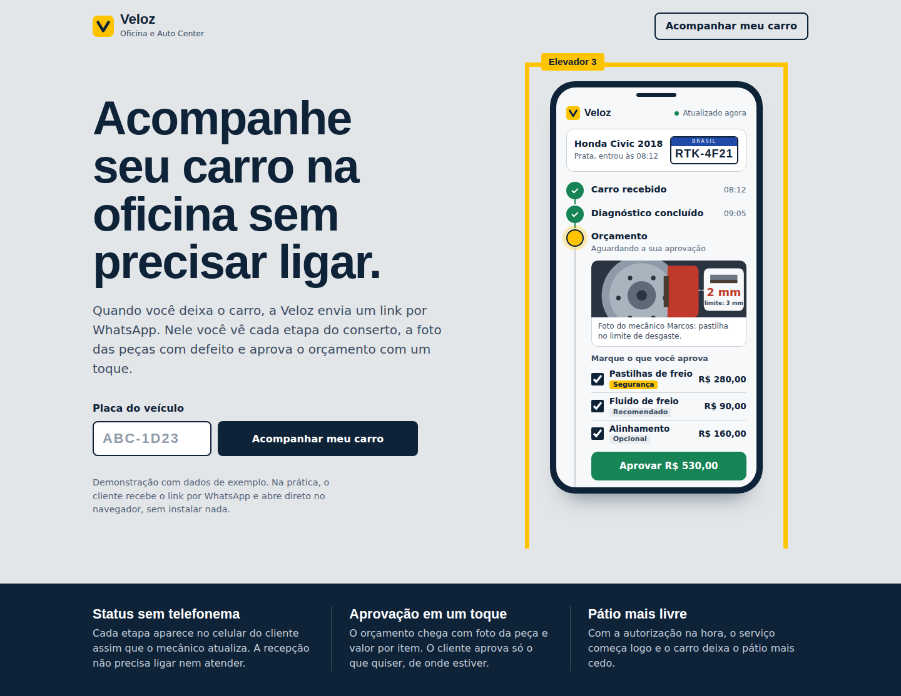
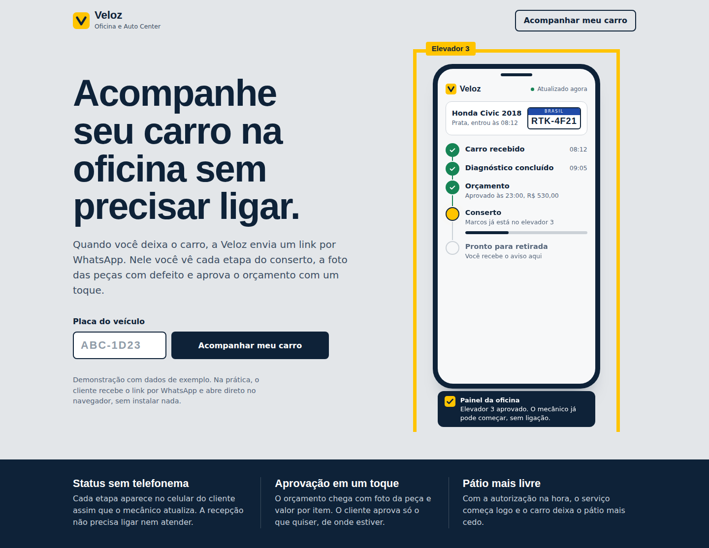
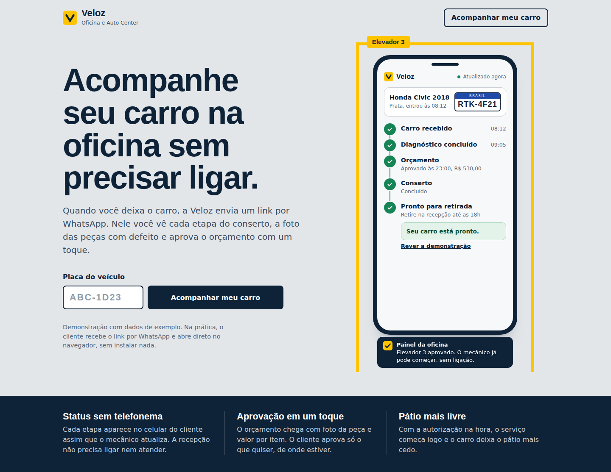

# Auto Center Veloz: Veloz Acompanha

Web app de acompanhamento de conserto e aprovação de orçamento pelo celular, criado para a **Oficina e Auto Center Veloz**.

> **Estudo de Caso 3** da disciplina de Design Profissional (Produção de Portfólio & Desenvolvimento Empresarial), Prof. Sedenilso Antonio Machado.

**Site publicado:** https://Chiminello99.github.io/autocenter-veloz/



---

## 1. Briefing do problema

A Auto Center Veloz é uma oficina mecânica de manutenção preventiva e corretiva de carros de passeio, liderada pelos irmãos Eduardo (gerente de oficina) e Henrique (financeiro e compras). Tem 5 elevadores, 6 mecânicos e 2 recepcionistas, e boa reputação técnica na cidade.

**A dor:** o orçamento é impresso na entrada e a autorização de peças é pedida por telefone. Com a frota de clientes crescendo, isso gerou gargalos:

- O telefone da recepção não para de tocar com clientes querendo saber o status do carro ou pedindo fotos das peças.
- Os mecânicos param o trabalho para responder à recepção.
- Os clientes demoram horas para aprovar orçamentos por mensagem.
- O pátio fica lotado de carros parados esperando resposta.
- Se nada mudar, a oficina perde eficiência e acumula avaliações negativas por falha de comunicação.

**A oportunidade:** a concorrência é formada por concessionárias (caras, mas com relatórios digitais) e oficinas pequenas e informais. A Veloz pode unir a confiança técnica que já tem a um canal rápido e transparente de comunicação e aprovação de serviços.

## 2. A solução

**Veloz Acompanha** é um web app. Quando o cliente deixa o carro, a oficina envia um link por WhatsApp. Nele o cliente:

1. acompanha cada etapa do conserto (recebido, diagnóstico, orçamento, conserto, pronto);
2. vê a foto das peças com defeito, enviada pelo mecânico;
3. aprova, item por item, o orçamento com um toque;
4. recebe o aviso quando o carro está pronto para retirada.

Do lado da oficina, a aprovação aparece na hora para a equipe, sem ligação e sem interromper o mecânico.

### Resultado esperado

| Problema atual | O que muda |
| --- | --- |
| Ligações de status na recepção | O status fica no celular do cliente, atualizado pelo mecânico |
| Cliente pede foto da peça | A foto já vem anexada ao orçamento |
| Aprovação demora horas | Aprovação em um toque, por item |
| Pátio lotado de carros aguardando | Serviço começa logo após a autorização |

> Os ganhos acima são os objetivos do projeto. Ainda não foram medidos em operação real.

## 3. Por que um web app (e não um aplicativo móvel ou um dashboard)?

| Opção | Avaliação |
| --- | --- |
| **Aplicativo móvel** | Exigiria que o cliente baixasse um app para usar uma ou duas vezes. Quem não instala simplesmente continuaria ligando. |
| **Site institucional** | Mostraria a oficina, mas não resolveria o fluxo de status e aprovação. |
| **Dashboard interno** | Ajuda a equipe, mas não tira o cliente do telefone. |
| **Web app por link (escolhido)** | Abre direto do WhatsApp, funciona em qualquer celular, não exige instalação nem cadastro e atende exatamente o momento em que o cliente quer saber do carro. |

O web app é a única opção que remove a ligação do cliente sem pedir nada dele. Um painel interno para a equipe é a evolução natural (ver Próximos passos).

## 4. Protótipo e telas

A entrega deste repositório é a **capa do site com um protótipo interativo** da tela do cliente. Os dados (carro, valores, horários, foto) são de exemplo.

| Orçamento aguardando aprovação | Conserto em andamento |
| --- | --- |
|  |  |

| Pronto para retirada | Versão para celular |
| --- | --- |
|  |  |

**Decisões de design**

- **Metáfora da vaga de elevador:** o celular fica dentro de uma vaga pintada de amarelo, como no piso de uma oficina, com a etiqueta "Elevador 3".
- **Paleta:** concreto (fundo), azul-petróleo (texto e botões) e amarelo de sinalização (destaque). Verde é usado só para o que está aprovado ou concluído.
- **Tipografia:** Overpass, derivada da sinalização rodoviária, nos títulos; Hanken Grotesk no texto.
- **Acessibilidade:** foco visível no teclado, respeito a `prefers-reduced-motion`, campos com rótulo e avisos de status lidos por leitores de tela.
- **Responsivo:** testado em desktop e em tela de 390 px.

## 5. Arquitetura

O protótipo é um **site estático** com HTML, CSS e JavaScript puros, em um único arquivo, sem dependências, sem build e sem backend.

```
autocenter-veloz/
├── index.html      # capa + protótipo interativo (HTML, CSS e JS)
├── docs/           # capturas de tela usadas neste README
├── .gitignore
├── LICENSE
└── README.md
```

**Fluxo do protótipo (máquina de estados no JavaScript):**

```
review (orçamento aguardando)  --Aprovar-->  repair (conserto)  --3,8 s-->  ready (pronto)
        ^                                                                       |
        +--------------------------- "Rever a demonstração" --------------------+
```

**Arquitetura prevista para a versão completa** (não implementada nesta entrega):

```
Mecânico (tablet)  -->  API  -->  Banco de dados
                         |
                         +--> Mensagem por WhatsApp com link único do veículo
                         |
Cliente (celular)  <-- Web app (link com token) --> aprova itens --> API --> Painel da equipe
```

## 6. Como executar

Não há nada para instalar.

**Opção 1: abrir direto.** Baixe ou clone o repositório e abra o `index.html` no navegador.

```bash
git clone https://github.com/SEU-USUARIO/autocenter-veloz.git
cd autocenter-veloz
```

**Opção 2: servidor local** (opcional):

```bash
python3 -m http.server 8000
# acesse http://localhost:8000
```

**Opção 3: GitHub Pages.** Em *Settings > Pages*, escolha *Deploy from a branch*, branch `main`, pasta `/ (root)`.

**Como testar a demonstração:**

1. Digite uma placa no formato `ABC-1D23` e clique em **Acompanhar meu carro**.
2. No celular, desmarque ou mantenha os itens e toque em **Aprovar**.
3. Veja o conserto avançar até "Pronto para retirada" e o aviso do painel da oficina.

## 7. Segurança

Este repositório **não contém credenciais, senhas, tokens ou chaves de API**, nem no código nem no histórico de commits. O protótipo não faz requisições a serviços externos, exceto o carregamento de fontes do Google Fonts. O `.gitignore` bloqueia `.env`, chaves e arquivos de credenciais para o caso de uma versão com backend.

## 8. Próximos passos

- Painel interno para os mecânicos postarem fotos e atualizarem etapas, e para a recepção acompanhar os elevadores.
- Envio automático do link por WhatsApp (API oficial).
- Link único por veículo, com token e prazo de validade.
- Histórico de serviços por placa.
- Medição em operação real: ligações de status por dia e tempo entre orçamento e aprovação.

## 9. Licença

Distribuído sob a licença MIT. Veja o arquivo [LICENSE](LICENSE).


